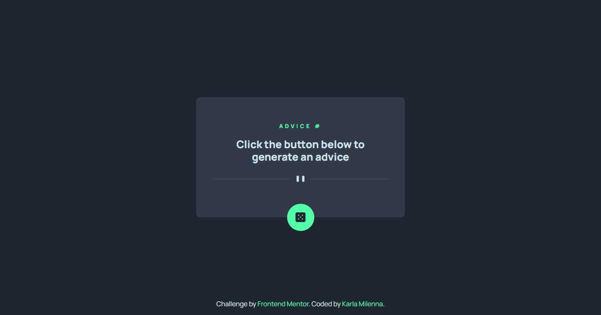

# Frontend Mentor - Advice generator app

Desafio Advice Generetor app do [Frontend Mentor](https://www.frontendmentor.io/challenges/advice-generator-app-QdUG-13db) concluído.

## Tabela de conteúdos
  - [Overview](#overview)
    - [Links](#links)
  - [Meu processo](#meu-processo)
    - [Tecnologias utilizadas](#tecnologias-utilizadas)
    - [O que aprendi](#o-que-aprendi)
  - [Autor(a)](#autora)

## Overview

### Links
- Live Site URL: [Advice generetor App](https://your-live-site-url.com)

## Meu processo

### Tecnologias utilizadas

- HTML5
- CSS
- Flexbox
- Mobile-first
- [React](https://reactjs.org/)
- [ViteJS](https://vitejs.dev/)
- Fetch API

### O que aprendi

Com esse projeto pude praticar posicionamento dos objetos, criação de projetos ReactJs + ViteJs, criação de componentes e o consumo de Apis utilizando o fetch.

## Autor(a)

- Website - [Karla Milenna](https://karlamilenna.netlify.app/)
